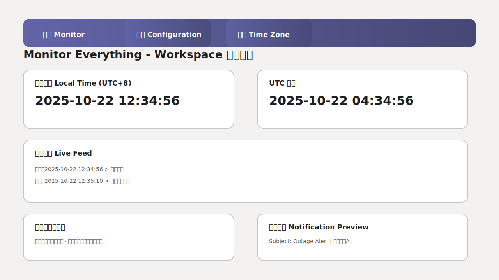

# DataMonitor

DataMonitor 是一款面向运维场景的桌面监控与通知管理工具，提供图形化配置、实时日志以及邮件告警能力。

## 界面预览与使用说明



1. 启动应用：在已准备好 `Config.ini` 的环境中执行 `python main_frame.py`，默认进入监控视图，顶部导航采用 Workspace 风格配色。
2. 监控视图：左侧显示本地时间，右侧显示 UTC 时间；下方实时日志滚动展示最新事件。
3. 启停控制：命令条中的“启动/关闭”按钮仅负责启动或停止监控调度器，停止后界面会保持开启，方便重新启动或查看日志；若需退出程序，请使用旁侧新增的“退出 Exit”按钮或窗口默认的关闭操作。
4. 配置向导：点击“配置 Configuration”按钮切换到配置视图，可在列表中增删监控项，右侧表单提供实时校验与通知邮件预览，保存后立即写入配置文件。
5. 偏好设置：点击“设置 Preferences”导航进入偏好中心，可调整时区、主题与语言，所有变更即刻生效并写入配置。

## 邮件配置与凭证管理

为避免将敏感凭证写入仓库，应用在加载邮件配置时遵循以下优先级：

1. **环境变量（推荐）**：直接在部署环境中设置以下变量，所有字段必须同时提供。
   - `MAIL_SMTP_SERVER`
   - `MAIL_SMTP_PORT`
   - `MAIL_USERNAME`
   - `MAIL_PASSWORD`
   - `MAIL_FROM`
   - `MAIL_TO`
2. **外部配置文件**：设置环境变量 `MAIL_CONFIG_PATH` 指向一份不纳入版本控制的 `ini` 文件。该文件需包含 `[Mail]` 节点，并提供上表中的全部字段。
3. **项目内默认模板**：仅当未提供上述配置时才会回退到仓库根目录的 `config.ini`。仓库中提供的是占位示例值，部署前务必覆盖。

### 监控项覆盖默认收件人

若某个监控项需要发送给不同的收件人，可在 `Config.ini` 中的对应 `MonitorX` 节点下填写 `email` 字段（支持以逗号分隔多个地址）。运行时程序会优先使用该字段，其次才回退到全局的 `[Mail].to_addrs` 配置。

### 外部配置文件示例

```ini
[Mail]
smtp_server = mail.internal.example.com
smtp_port = 587
username = ops-team@example.com
password = ${MAIL_PASSWORD}
from_addr = ops-team@example.com
to_addrs = alerts@example.com
```

建议将凭证文件放置在仅运维可访问的目录，例如 `/etc/datamonitor/mail.ini`，并通过 `chmod 600` 限制权限：

```bash
export MAIL_CONFIG_PATH=/etc/datamonitor/mail.ini
chmod 600 /etc/datamonitor/mail.ini
```

### 缺失字段的处理方式

若环境变量或外部配置文件缺少任意字段，程序会抛出明确异常并停止发送邮件，以防使用不完整的配置。确保每次变更后执行冒烟测试，验证告警邮件功能正常。

### 默认占位符的安全校验

首次在未提供真实 SMTP 凭据的环境中启动程序时，仓库生成的 `Config.ini` 会携带 `<...>` 占位值。读取配置时系统会直接抛出 `ValueError`，报错内容包含“缺少真实 SMTP 配置，请按照 README 覆盖配置后重试”，提示运维立即替换为有效凭据。这一机制确保占位模板不会被误用于生产环境。

### 邮件主题与正文示例

监控程序根据不同事件类型生成固定的邮件主题前缀，便于运维在收件箱中快速筛选：

- 服务异常告警：`故障告警 | <服务名称>`
- 服务恢复通知：`故障恢复 | <服务名称>`

邮件正文首行会明确标注事件状态，常见示例如下：

```
主题: 故障告警 | <服务名称>

状态：告警
服务：<服务名称>
说明：监控检测到服务不可达
发生时间：[UTC 时间戳]
```

```
主题: 故障恢复 | <服务名称>

状态：恢复
服务：<服务名称>
说明：监控检测到服务恢复至正常状态
恢复时间：[UTC 时间戳]
```

## 通知模版配置

为降低硬编码字符串的维护成本，程序在运行时会从配置目录（`<APIMONITOR_HOME>/Config/`）中加载 `Templates.ini`。若文件缺失，则自动回退到内置模版。

- **邮件模版 (`[mail]`)**：
  - `alert_subject` / `alert_body`：服务不可达时发送的邮件内容。
  - `recovery_subject` / `recovery_body`：服务恢复时发送的邮件内容。
- **UI 提示 (`[ui]`)**：
  - `status_line`：写入 GUI 队列与终端输出的统一提示文案。
- **日志模版 (`[log]`)**：
  - `action_line`：`monitoring.log_recorder.record` 的 Action 行。
  - `detail_line`：记录状态明细的内容。
  - `record_entry`：文本日志整体格式。
  - `csv_header`：CSV 文件首行标题（以逗号分隔）。

监控状态机（`monitoring/state_machine.py`）在生成 `MonitorEvent` 时同样使用以上 UI 与日志模版，因此修改模版即可同步影响 CLI/GUI 提示、日志记录等所有渠道的输出。

所有模版均支持 Python `str.format` 占位符，常用字段包括：

- `{service_name}`：监控项名称。
- `{status_label}` / `{status_text}`：用于 UI 与 CSV 的状态描述。
- `{status_action}`、`{event_description}`、`{time_label}`：邮件正文中使用的语义化字段。
- `{event_timestamp}`：事件发生时间（已格式化）。
- `{interval}`、`{monitor_type}`、`{url}`：日志与表格所需的辅助信息。

一旦修改 `Templates.ini`，重启服务即可生效；如果模版缺失或缺少占位符，程序会提供明确错误信息并回退到安全状态，避免发送不完整的通知。

## 国际化资源维护

- `i18n/catalog.json` 是全部界面与模版文案的单一真源，按上下文 (`context`) 列出源文本与各语言译文。
- 修改或新增条目后执行 `python i18n/build_translations.py`，脚本会生成 `*.qm.json` 供 `JsonTranslator` 在运行时加载。
- 新增语言时需在 `catalog.json` 的 `languages` 列表中注册编码，并补全每个上下文的译文，随后重新生成翻译文件。
- PR 前务必运行 `pytest tests/test_i18n_integrity.py`，该用例会校验翻译键值是否一致，并验证中英通知模版可正确渲染。
- 主窗口语言切换会自动刷新主题名称、命令条按钮等文案，并触发模版管理器 `reload()`，无需手动清理缓存。

## 日志目录配置

日志文件及运行时生成的监控 CSV 会存放在“日志根目录”下。程序根据以下优先级确定该目录：

1. 环境变量 `APIMONITOR_HOME`（推荐）。
2. 根目录 `config.ini` 中的 `[Logging].log_file` 配置项。
3. 仓库内默认路径 `data_monitor/`。

无论采用何种方式，目录路径最终都会被归一化为绝对路径，并保证以分隔符结尾。例如：`/var/log/datamonitor/`。若配置为相对路径，则会基于对应配置文件所在目录解析。

> **提示**：仓库根目录的 `config.ini` 既可作为示例模板，也可直接填写真实参数。应用会优先加载 `<APIMONITOR_HOME>/Config/Config.ini`（若未设置 `APIMONITOR_HOME`，默认指向 `data_monitor/Config/Config.ini`），若该文件缺失或仍保留占位符，再回退到根目录的 `config.ini`。首次启动时系统会自动生成带有完整占位项的配置，其中包含日志、请求超时、时区、语言以及邮件发送所需的全部字段，运维可在任一位置覆盖为真实值。

`[Logging]` 节还支持下列可选项，用于控制日志输出行为：
- `log_level`：记录级别，支持标准名称（`DEBUG`、`INFO` 等）或数值。
- `log_filename`：主日志文件名，默认 `system.log`，存放于 `<日志根目录>/Log/`。
- `log_max_size` 与 `log_backup_count`：滚动日志的单个文件大小与备份数量，支持 `10MB`、`1GB` 等写法。
- `log_format` / `log_datefmt`：日志格式与日期格式，遵循 `logging.Formatter` 语法。
- `log_console`：布尔值，控制是否同步输出到标准错误流。

### 生成配置模板

调用 `configuration.writeconfig(config_dir)` 会确保 `config_dir` 存在，并在 `config_dir/Config.ini` 中生成示例模板。模板仅包含占位符，运维需要手工覆盖为真实值或提供独立的外部配置文件。

### 异常日志查看位置

调度层（`monitoring.service`）与邮件发送模块（`monitoring.send_email`）统一通过 Python `logging` 输出错误日志，记录器名称分别为 `monitoring.service` 与 `monitoring.send_email`。程序启动时会自动调用 `configuration.configure_logging()`，基于上述 `[Logging]` 配置创建一个按大小轮转的文件处理器（路径为 `<日志根目录>/Log/<log_filename>`），并在需要时同步输出到终端。修改配置后重启应用即可生效，无需额外编写脚本。所有异常堆栈与错误描述都会被归档在同一日志目录中，方便集中检索与审计。

## 安全建议

- 不要在版本库中提交真实凭证。
- 不要在公共仓库暴露生产环境的日志与配置文件。

## MIT 合规替代方案规划

### 许可证评估与风险点

- **PyQt5 许可证限制**：仓库当前 UI 层大量依赖 PyQt5（GPLv3/商业授权），对外分发时将整体项目纳入 GPL 约束，要求公开全部源代码，并在二进制发布时同时开放衍生作品源码；与仓库声明的 MIT 授权不兼容，发布 MIT 版本会面临侵权风险。【F:main_frame.py†L6-L6】【F:ui/components/navigation.py†L6-L6】
- **二次发布义务冲突**：MIT 允许闭源分发，而 GPLv3 强制传递 copyleft；一旦继续绑定 PyQt5，后续的商业或闭源部署必须购买额外商业授权，增加合规成本。
- **依赖链影响**：`tests/`、`controllers/` 与 `ui/` 模块均直接引用 PyQt5 API，迁移时需要同步替换测试夹具与事件循环处理逻辑，否则会阻断 CI 测试与可视化功能。【F:tests/test_ui_main_window.py†L16-L20】【F:controllers/main_window.py†L8-L9】
- **发行版构建风险**：当前发布脚本未显式隔离 UI 组件，若继续捆绑 PyQt5 可执行文件，将触发 GPL 对静态/动态链接的附带条款，需在迁移完成前避免新增打包流程。

### 可选技术路径比较

| 方案 | 许可证 | 影响范围 | 优势 | 风险/成本 | 适用场景 |
| --- | --- | --- | --- | --- | --- |
| Qt for Python / PySide6 | LGPLv3（默认动态链接，允许 MIT 项目使用） | `ui/`、`controllers/`、`main_frame.py`、Qt 相关测试 | 与现有 Qt API 相似，迁移量可控；遵循 LGPL 仅需在发行包中提供动态库替换指引 | 需确保动态链接且未修改 Qt 库；CI 镜像需安装 Qt 运行时；Windows 打包需额外复制 Qt DLL | 保留完整桌面 UI 的主线方案 |
| 拆分核心监控模块（保留 CLI + API 层） | MIT（纯 Python，无 Qt 依赖） | 将 `monitoring/` 与配置模块独立为 MIT 核心；UI 作为可选插件 | 核心功能立即回归 MIT；可在后续引入 Web UI、TUI 等替代界面 | 现有桌面体验暂时缺失；需要额外维护插件接口文档 | 需要快速交付合规版本或面向服务器部署的场景 |

### 目标版本与时间表

- **目标版本**：v1.1.0（下一次 Minor 发布，4 周内完成 PySide6 迁移并验证）。
- **阶段划分**：
  1. 第 1 周：完成 PySide6 POC，验证主窗口、导航栏、配置向导的事件循环与样式兼容性。
  2. 第 2 周：批量替换 UI、控制器与测试中的 PyQt5 引用，补齐类型适配与翻译加载差异。
  3. 第 3 周：更新打包脚本、CI 镜像与开发文档，确保动态链接与运行时依赖合规。
  4. 第 4 周：执行回归测试与 Beta 发布，收集反馈并完成许可证声明更新。

### 责任分工

- **架构负责人**：评估 PySide6 替换点、确认 LGPL 合规要求，审批核心模块拆分方案。
- **UI 负责人**：完成 `ui/` 与 `controllers/` 目录的 API 替换，修复主题、翻译与事件绑定差异。
- **测试负责人**：维护 `tests/test_ui_*.py` 与 `tests/test_controllers.py`，确保 pytest-qt 针对 PySide6 正常运行，补充无 UI 模式的冒烟用例。
- **运维负责人**：更新部署脚本、打包流程与依赖镜像，确保 LGPL 动态库随发行包正确声明。

### 验收标准

- 所有 pytest 用例（含 `@pytest.mark.qt`）在 PySide6 环境下通过，CI 覆盖率与迁移前一致或更高。
- 发布文档与应用启动日志中明确标注 PySide6 许可证及动态库替换指引。
- MIT 核心模块可在无 Qt 依赖的环境中安装并运行基础监控任务（验证 `monitoring/` 与 `configuration.py` 的 CLI 工作流）。
- 新增或更新的部署脚本通过一次端到端发布演练，确保依赖、许可证文件与 README 中说明一致。

### 脚本、文档与验证更新清单

- **自动化脚本**：更新可能存在的打包或启动脚本（如 `main_frame.py` 启动入口）以加载 PySide6；在构建流程中增加 LGPL 动态库分发校验。
- **测试配置**：调整 CI/本地开发说明，确保安装 `PySide6` 与 `pytest-qt>=4.4`，并同步修改 `pytest.importorskip("PyQt5")` 为新的依赖检测。【F:tests/test_ui_layout.py†L10-L12】
- **文档**：在 README 与发行说明中记录迁移步骤、许可证注意事项及核心模块拆分策略，确保外部贡献者遵守新流程。
- **验证步骤**：在发布 checklist 中加入“许可证合规自检”与“动态链接验证”，对照 `ldd`/`otool` 输出确认未与 Qt 静态链接；针对核心模块执行无 UI 冒烟脚本，确保拆分后功能可独立运行。
- 通过 CI/CD 将凭证注入环境变量或安全的密钥管理服务。
- 定期轮换邮箱密码，并在更新后同步环境变量或外部配置文件。
- 完成配置后，所有异常堆栈与错误描述都会写入 `<日志根目录>/Log/system.log`，与现有的文本日志和 CSV 文件放置在同一位置，便于统一检索与归档。
- 核查部署节点的日志与备份策略，避免凭证被意外写入日志或备份。

## License

本项目按 [MIT License](LICENSE) 授权发布。详见 [LICENSE](LICENSE) 文件。

## 技术栈与合规

| 组件 | 许可证 | 主要用途 |
| --- | --- | --- |
| PyQt5 | GPL / Commercial | 提供跨平台的图形界面组件与事件循环，是主窗口、导航栏等界面功能的运行时基础。 |
| requests | Apache-2.0 | 承担 HTTP/HTTPS 探测请求，支撑 API 服务可用性监控及超时、连接错误处理。 |
| PyYAML（可选） | MIT | 解析 `ui/theme.py` 中的主题 YAML 配置，便于运维按需扩展主题令牌。 |

### MIT 授权分发要求

- 发布二进制或源码分发包时，需在随附文档中保留原始的 `LICENSE` 文件及版权声明，并在致谢/关于页面中标注“© DataMonitor 项目贡献者，MIT License”。
- 如对源文件进行再分发或嵌入到其他项目，应确保保留文件头部的版权与许可文本，不得移除或混淆相关信息。
- 当仓库出现新贡献者时，应在 `LICENSE` 或版权声明位置增补贡献者名单或链接至贡献者列表，以完整覆盖 MIT 授权主体。

### 依赖许可证复核流程

- **核查频率**：按季度开展许可证审计，遇到版本升级或新增依赖时同步触发临时复核。
- **责任分工**：由运维合规负责人（例如 TechOps/Compliance Role）统筹，代码所有者配合提供依赖变更信息。
- **核查步骤**：
  1. 对照部署使用的依赖锁定文件（如 `requirements*.txt`、`poetry.lock` 等）更新版本信息，确认许可证类别无变动或评估变动影响。
  2. 检查各依赖的许可证是否与 MIT 主许可证兼容，并记录潜在限制（如 GPL 的商用分发要求）。
  3. 在 `docs/` 目录维护的合规记录表中追加检查日期、结论及需要跟踪的整改项。
  4. 如发现许可证冲突或条款变更，向项目维护者提交 issue/合规提醒，并在下一次发行前完成整改。

## 网络检测权限说明

- `monitor_server` 在检测网络连通性时会优先尝试原始 ICMP Ping。如需启用该功能，运行程序的账户必须具备管理员或 root 权限，否则程序会自动回退到系统 `ping` 命令或仅执行 HTTP 检查。
- 在缺少权限的环境中，无需额外配置即可继续使用 HTTP 检查结果，函数会返回布尔值而非抛出异常。

## 模块划分与扩展指南

### 界面与控制器

- `ui/main_window.py` 提供导航栏、监控仪表盘与配置向导等界面组件，负责纯粹的布局与交互控件定义。
- `controllers/main_window.py` 封装 `MainWindowController`，集中处理主题切换、调度协调与配置保存逻辑，减少 `main_frame.py` 的耦合度。
- `ui/theme.py` 统一声明 `ThemeDefinition` 与 `Workspace` 风格主题常量，便于后续扩展或替换主题资源。

### 调度与状态管理

- `monitoring/service.py` 实现调度层，负责读取 `configuration.read_monitor_list()` 返回的结构化监控项，按类型查找已注册的策略并以独立线程循环执行。调度层同时协调状态机、日志写入以及通知分发，使得 UI (`main_frame.ToolsetWindow`) 仅承担展示职责。
- `monitoring/state_machine.py` 提供 `MonitorStateMachine`，根据监控结果驱动状态切换并生成统一的 `MonitorEvent`。事件中包含状态描述、日志内容、CSV 行以及通知模版信息，便于在不同渠道重用。

### 策略注册

- 监控类型通过策略模式解耦，默认提供 `GET`、`POST`、`SERVER` 三种策略，均在 `MonitorScheduler` 初始化时注册。若需新增类型，可实现 `MonitorStrategy.run()` 并调用 `scheduler.register_strategy('NEW_TYPE', strategy)` 即可。

### 配置读取

- `configuration.read_monitor_list()` 现返回 `MonitorItem` 数据类，对 `name`、`url`、`type`、`interval` 等字段完成校验与规范化（类型大写、间隔转为正整数、可选 JSON/键值对解析）。业务层无需再做重复的类型转换或合法性检查。

### 单元测试

- 新增的 `tests/test_monitoring.py` 覆盖调度器和状态机的核心分支，验证状态迁移、通知生成、日志写入回调等行为。
- `tests/test_configuration.py` 增补对结构化配置读取与异常场景的测试，确保基础数据在进入调度层前即被校验。
